# Form Login dan Register Interaktif
### MUHAMMAD RENDRA IRAWAN | 362458302036

## Implementasi Kode Flutter
- Kode main.dart
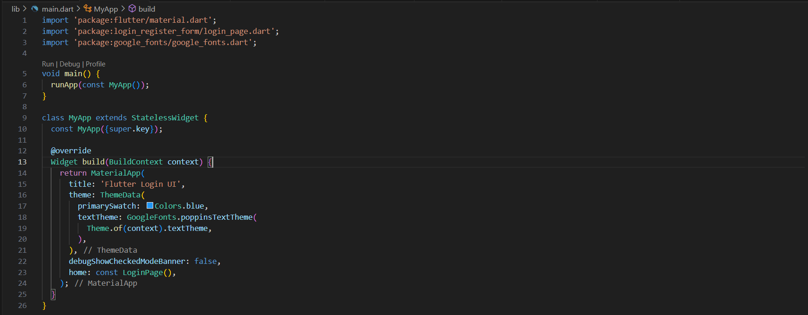

- Kode data/user.dart
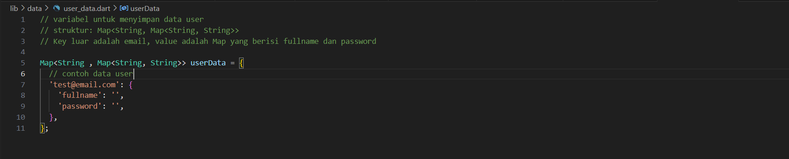

- Kode register_page.dart
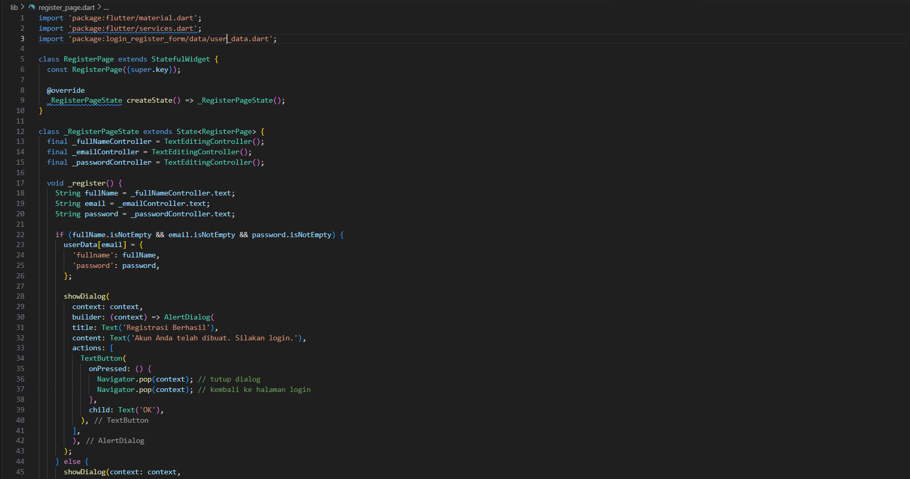
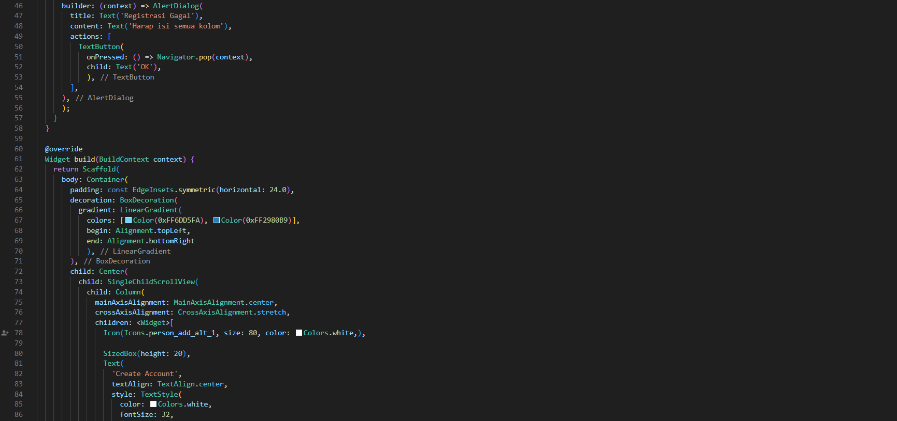
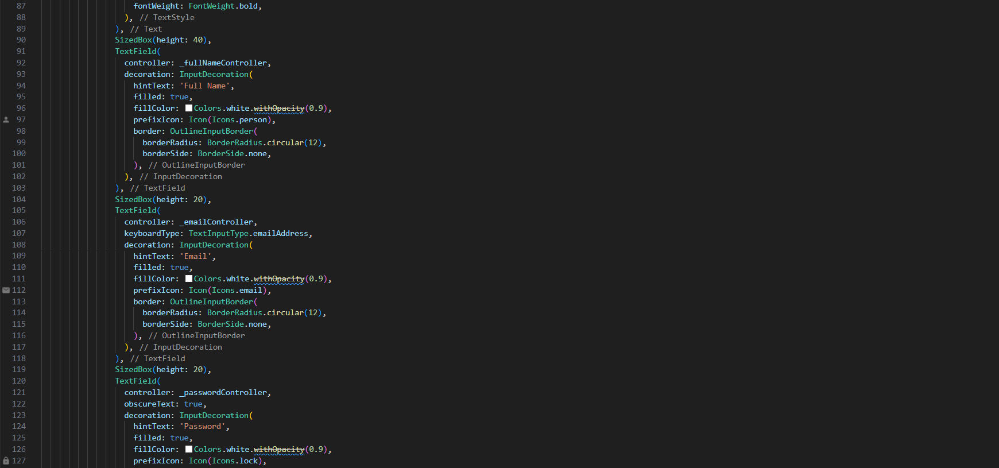
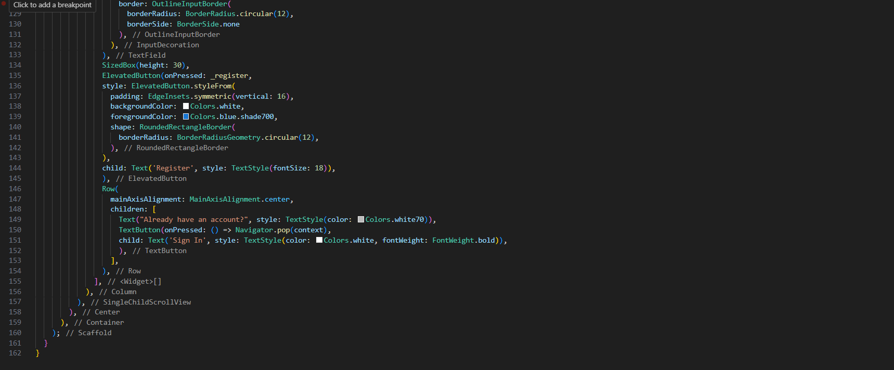

- Kode login_page.dart
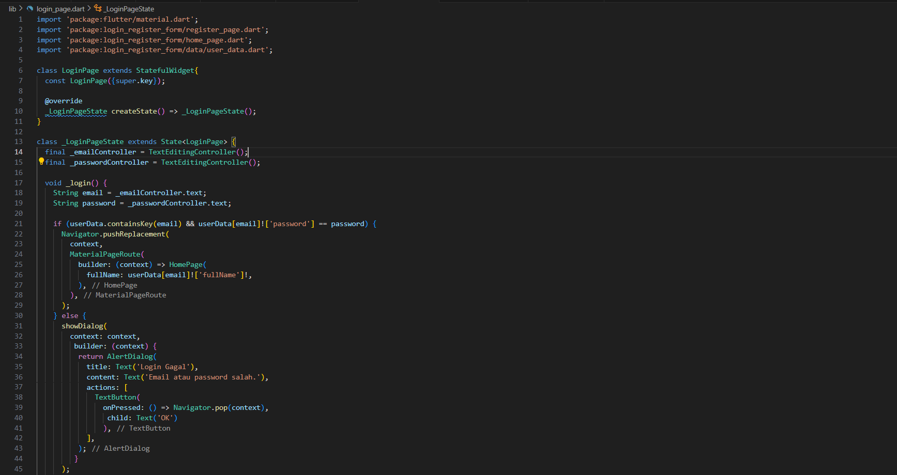
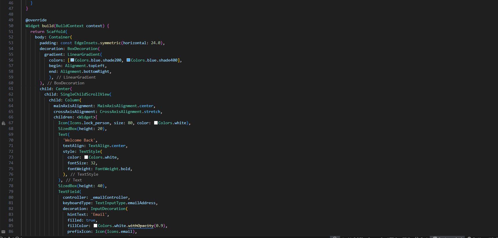
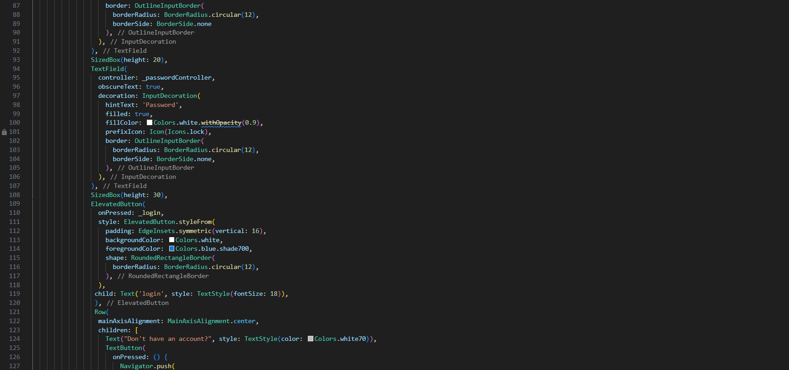
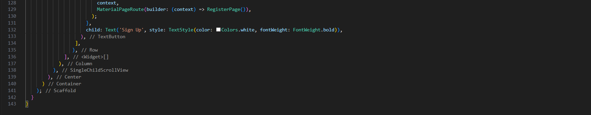

- Kode home_page.dart
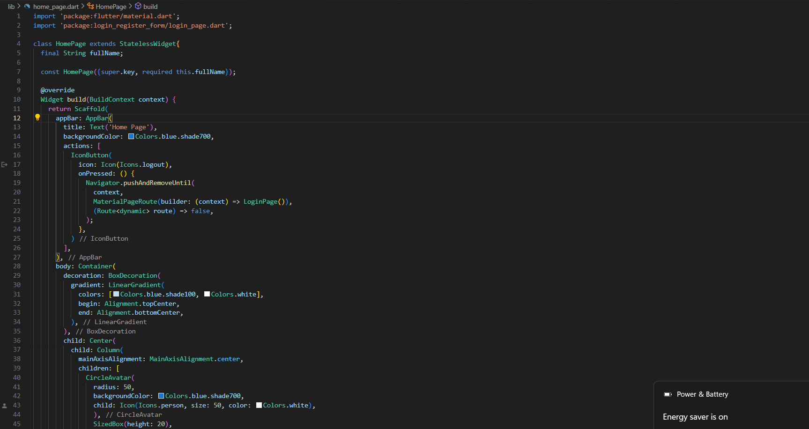
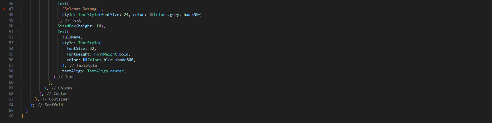

## Debuging
- Halaman Login
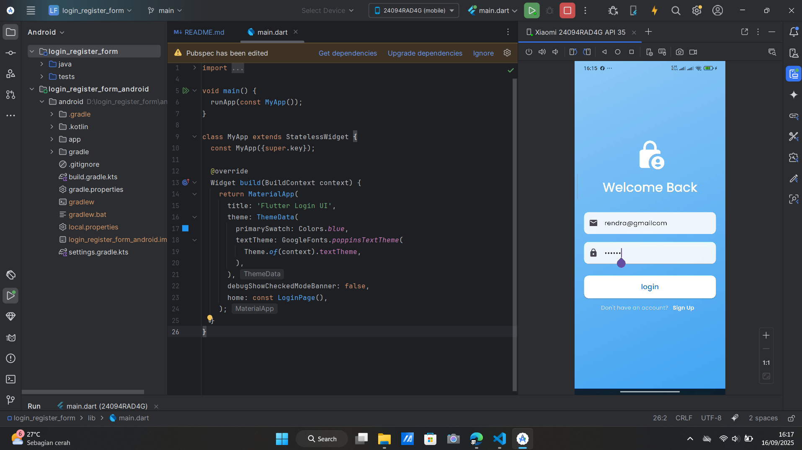
- Halaman Register
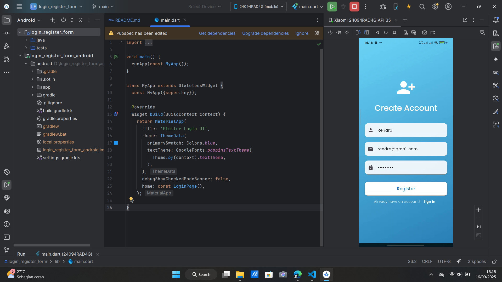
- Halaman Home
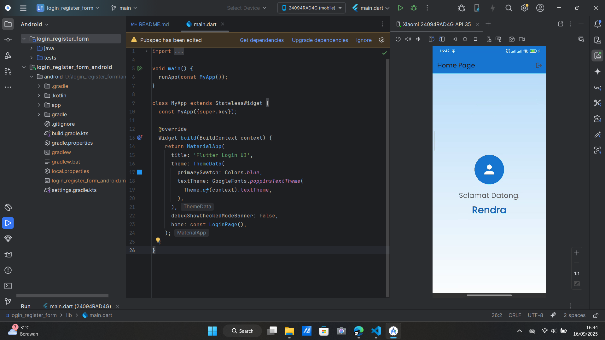

## Latihan Tambahan
- Menambahkan validasi input untuk memastikan format email benar mengandung "@" dan minimal password 8 karakter.

tambahkan kode ini pada file login.dart dan register.dart, dalam register() dan login().
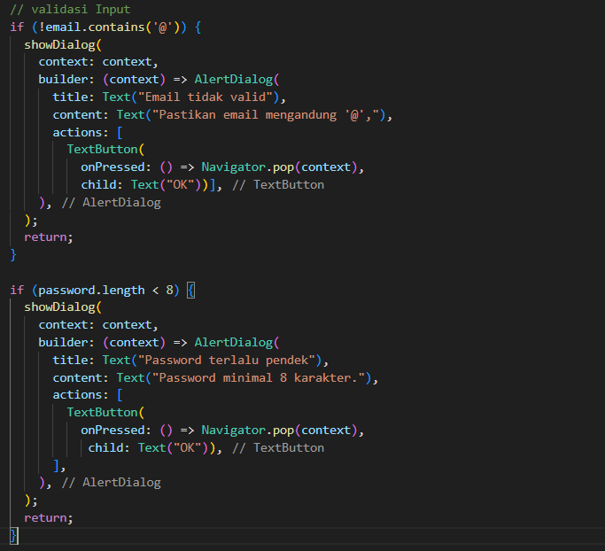

- Menambah ikon mata agar bisa menampilkan/menyembunyikan password.

tambahkan kode ini pada file login.dart dan register.dart.

tambahkan state

ganti TextField

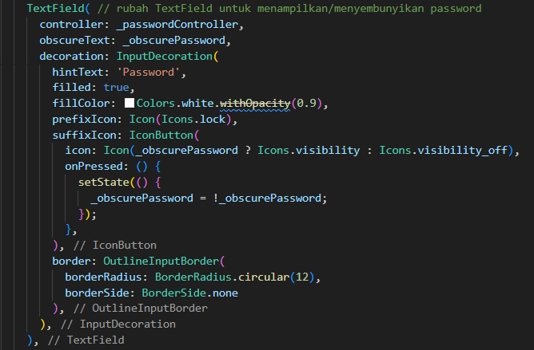

- Menambah Hero Widget.
Tempatkan di login_page.dart & register_page.dart pada Icon()

Pada login.dart

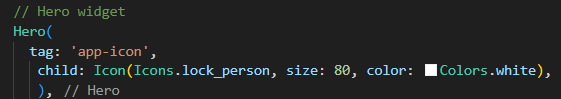

Pada register.dart

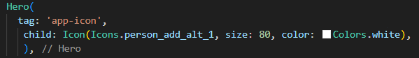

- Menyimpan sesi login.

- Menambah dependensi di pubspec

- Di login.dart impor prefs

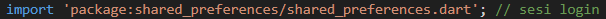

lalu, tambah kode berikut

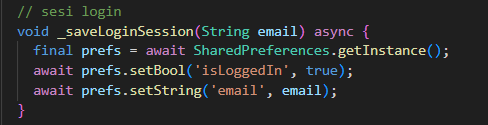

- Di main.dart, cek saat pertama kali app dijalankan
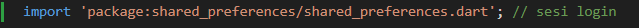

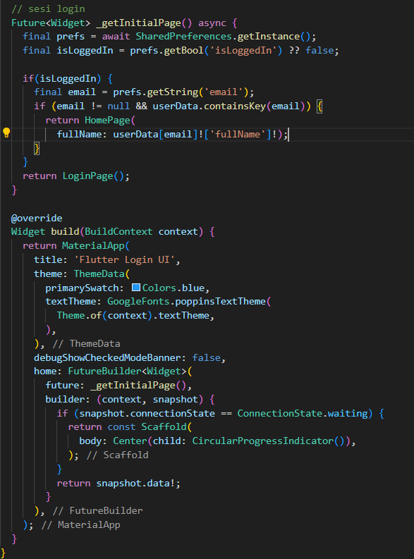

- Di home_page.dart, tambahkan logout agar sesi dihapus:
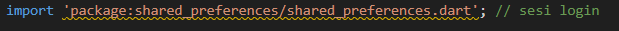
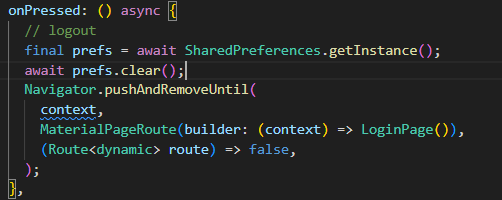

## Hasil akhir

- Halaman Register dengan  Validasi input
- Password terlihat

- Password sembunyi
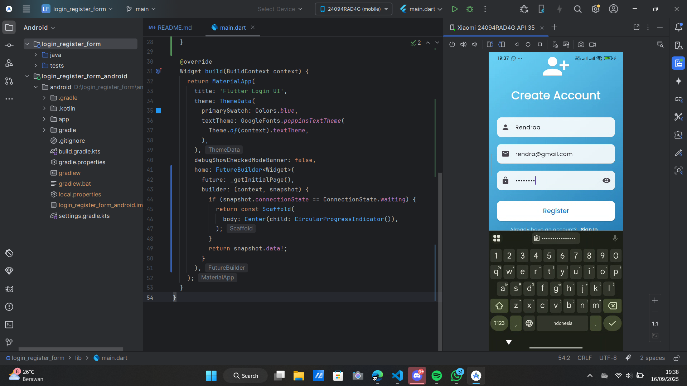

- Validasi ketika password kurang
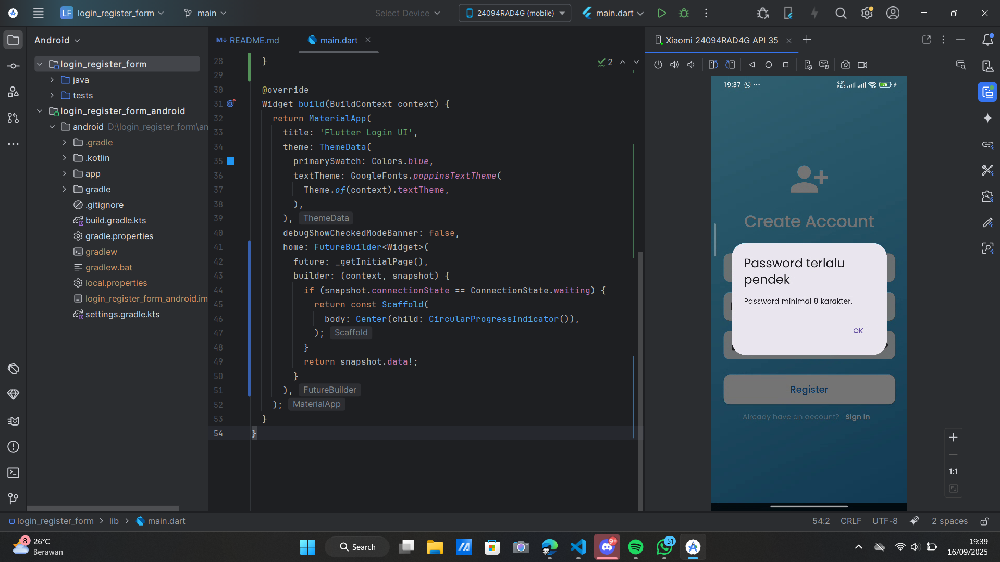

- Halaman Login
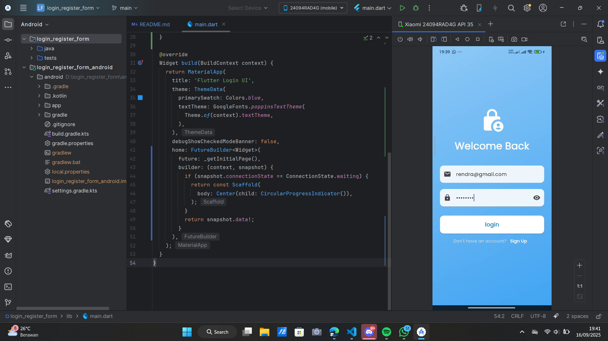

- Halaman Home
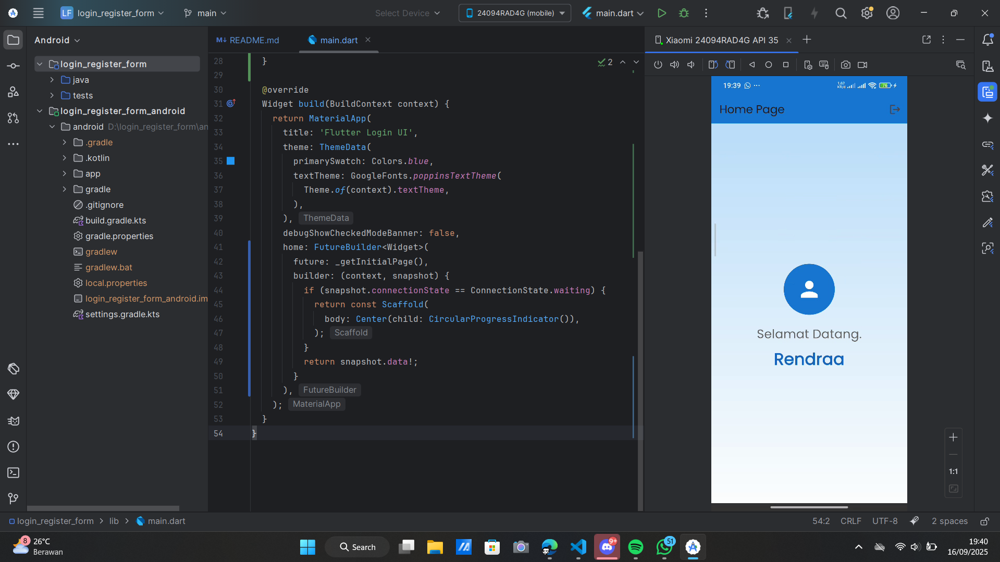

Terimakasih

