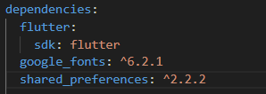
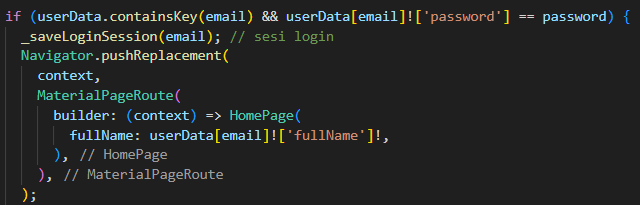

# Form Login dan Register Interaktif
### MUHAMMAD RENDRA IRAWAN | 362458302036

## Implementasi Kode Flutter
- Kode main.dart

- Kode data/user.dart

- Kode register_page.dart

- Kode login_page.dart

- Kode home_page.dart

## Debuging
- Halaman Login

- Halaman Register

- Halaman Home

## Latihan Tambahan
- Menambahkan validasi input untuk memastikan format email benar mengandung "@" dan minimal password 8 karakter.

tambahkan kode ini pada file login.dart dan register.dart, dalam register() dan login().

- Menambah ikon mata agar bisa menampilkan/menyembunyikan password.

tambahkan kode ini pada file login.dart dan register.dart.

tambahkan state

ganti TextField

- Menambah Hero Widget.
Tempatkan di login_page.dart & register_page.dart pada Icon()

Pada login.dart

Pada register.dart

- Menyimpan sesi login.

- Menambah dependensi di pubspec

- Di login.dart impor prefs

lalu, tambah kode berikut

- Di main.dart, cek saat pertama kali app dijalankan

- Di home_page.dart, tambahkan logout agar sesi dihapus:

## Hasil akhir

- Halaman Register dengan  Validasi input
- Password terlihat

- Password sembunyi

- Validasi ketika password kurang

- Halaman Login

- Halaman Home

Terimakasih

